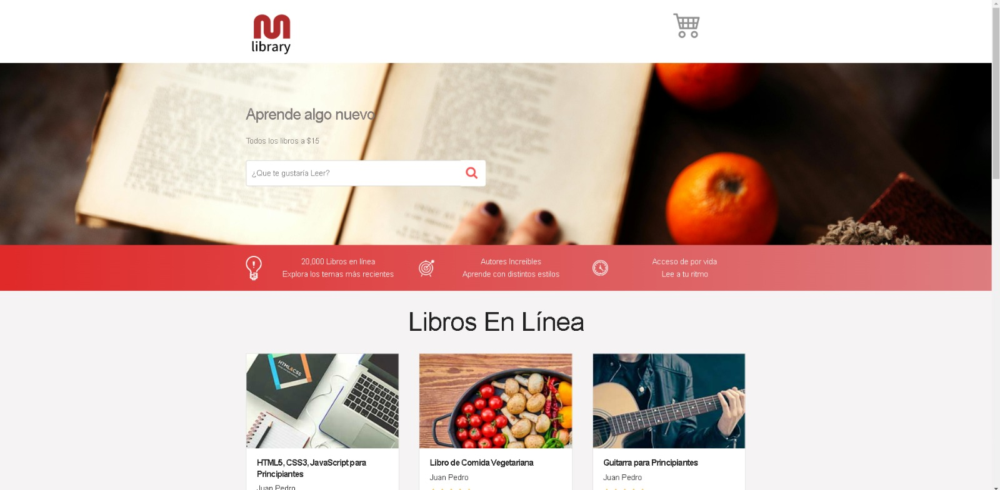
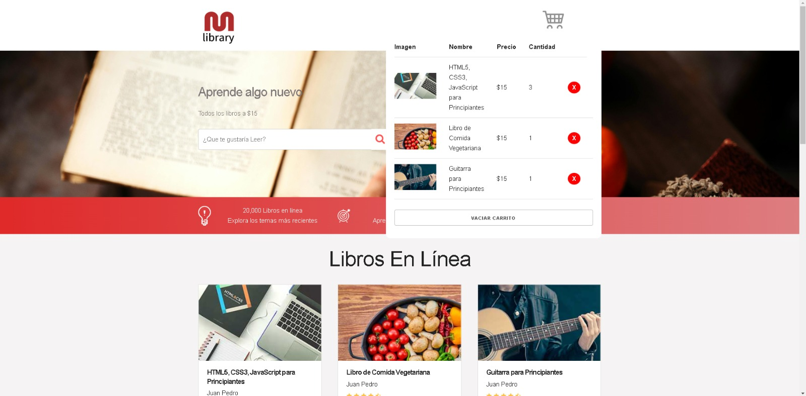
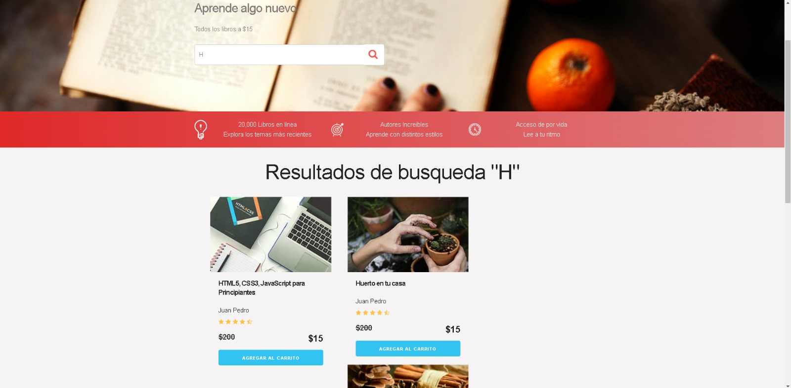

# 📚 Carrito de Libros con Barra de Búsqueda

Un proyecto simple y funcional desarrollado con JavaScript puro, que permite a los usuarios buscar libros, añadirlos a un carrito y guardar su selección en el **Local Storage**. El diseño es limpio y está organizado con un HTML estructurado y un CSS presentable.

## 🌟 Características

- **Barra de búsqueda:** Busca libros por título o autor con una interfaz interactiva.
- **Carrito de libros:** Añade libros al carrito y elimina libros si ya no los necesitas.
- **Local Storage:** Los datos del carrito se guardan automáticamente para que los usuarios no pierdan su selección al recargar la página.
- **Interfaz amigable:** HTML y CSS organizados para ofrecer una buena experiencia de usuario.

---

## 🚀 Tecnologías utilizadas

- **HTML5**: Estructura de la aplicación.
- **CSS3**: Diseño responsivo y estilizado.
- **JavaScript**: Manipulación del DOM y lógica de la aplicación.
- **Local Storage**: Persistencia de datos.

---

## 💂️📂 Estructura del proyecto

```
carrito-de-libros/
│
├── index.html        # Estructura principal del proyecto
├── css/
│   └── custom.css    # Estilos del proyecto
│   └── normalize.css
│   └── skeleton.css
├── js/
│   └── app.js        # Lógica principal del carrito y búsqueda
├── img/
│   └── cart.png    # Recursos como imágenes de ejemplo
│   └── curso1.jpg
│   └── curso2.jpg
│   └── curso3.jpg
│   └── curso4.jpg
│   └── curso5.jpg
│   └── estrellas.png
│   └── favicon.png
│   └── hero.jpg
│   └── icono1.png
│   └── icono2.png
│   └── icono3.png
│   └── logo-pagina.jpg
│   └── logo.png
└── README.md         # Documentación del proyecto
```

---

## 🛠️ Cómo ejecutar el proyecto

1. **Clona este repositorio** en tu computadora:
   ```bash
   git clone https://github.com/tu-usuario/carrito-de-libros.git
   ```

2. **Abre el archivo `index.html`** directamente en tu navegador:
   - Navega hasta la carpeta del proyecto y haz doble clic en el archivo `index.html`.

3. ¡Explora la barra de búsqueda y el carrito interactivo!

---

## 📖 Funcionalidades principales

### 1. Barra de búsqueda
- Escribe en el campo de búsqueda para filtrar libros por nombre o autor.
- Los resultados se actualizan en tiempo real.

### 2. Carrito de libros
- Haz clic en el botón **"Añadir al carrito"** para agregar un libro.
- El carrito muestra los libros seleccionados y te permite eliminarlos.
- El estado del carrito se guarda automáticamente en el Local Storage.

### 3. Persistencia de datos
- Aunque cierres la pestaña o recargues la página, los datos del carrito se mantendrán gracias al uso de **Local Storage**.

---

## 🎨 Capturas de pantalla

### Pantalla principal


### Carrito interactivo


### Busqueda


---

## 🤝 Contribuciones

¡Este proyecto está abierto a contribuciones! Si tienes ideas o mejoras, sigue estos pasos:

1. Haz un **fork** del repositorio.
2. Crea una nueva rama: `git checkout -b mejora-nueva`.
3. Realiza los cambios y haz un commit: `git commit -m "Descripción de tu mejora"`.
4. Sube los cambios: `git push origin mejora-nueva`.
5. Abre un **pull request** en GitHub.

---

## 📩 Contacto

Si tienes preguntas, sugerencias o comentarios, no dudes en contactarme:

**Bryan Daniel Macias**  
📍 Sacramento, California  
📞 913-827-8623  
📧 [danbrymadev@gmail.com](mailto:danbrymadev@gmail.com)

